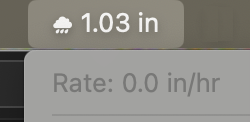

# SwiftBar PWS SmartWeather Plugin



This SwiftBar plugin displays live weather information from a personal weather station (PWS) using the Weather Underground API. It conditionally presents the most relevant weather data depending on current conditions — precipitation, temperature, dew point, and barometric pressure trend.

---

## 🌦️ Features


- **Dynamic display** in the macOS menu bar:
- **Clickable submenu link** to open your PWS dashboard on Weather Underground

  - ⛆ `precipTotal` (accumulated rainfall today) shows if it's raining
  - 🌡️ `temp` and dew point with a comfort emoji if it's not raining
- **Emoji-based comfort indicator** based on dew point:
  - 🏜️ < 50°F: Dry
  - 😊 50–59°F: Comfortable
  - 😐 60–66°F: Humid
  - 😓 67–71°F: Muggy
  - 🥵 72–75°F: Oppressive
  - 🔥 ≥ 76°F: Miserable
- **⏱️ Barometric pressure trends** (if available):
  - 📈 Rising
  - 📉 Falling
  - ➖ Steady
- Pressure trend is inferred by comparing current pressure with a value stored in a temporary file from the previous update.

---

## 🔧 Setup

1. **Install SwiftBar**:  
   Download from [https://github.com/swiftbar/SwiftBar](https://github.com/swiftbar/SwiftBar)

2. **Clone this repository** and configure your plugin:
   ```bash
   git clone https://github.com/asterizk/swiftbar-pws-smartweather.git 
   cd swiftbar-pws-smartweather 
   ```

3. **Configure your Weather Underground API credentials**:
   Copy the example file and insert your actual values:
   ```bash
   cp weather.conf.example weather.conf
   ```

   `weather.conf` contents:
   ```ini
   [weather]
   api_key = your_api_key_here
   station_id = your_station_id_here
   ```

4. **Install the plugin**:
   ```bash
   make install
   ```

5. ✅ It should now appear in your menu bar! (Updates every 5 minutes.)

---

## 🧹 Optional Commands

```bash
make run        # Run the plugin manually from terminal
make install    # Symlink the plugin into SwiftBar's plugin folder
make uninstall  # Remove plugin symlink from SwiftBar
```

---

## 📁 Files

- `pws-smartweather.5m.py`: The main SwiftBar plugin script
- `weather.conf`: Your local API credentials (excluded from git)
- `.gitignore`: Ensures credentials and temp files aren't tracked
- `Makefile`: Easy install/uninstall of the plugin

---

## 📌 Notes

- Plugin stores previous pressure reading in a temporary file in the same directory to determine pressure trends.
- API usage follows Weather Underground's guidelines (see their docs for rate limits).
- Script is dependency-free (uses only Python standard library).

---

## 🔐 Privacy

This plugin does **not** send data anywhere except to Weather Underground for retrieving weather data for your configured station.