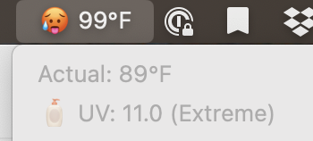

# SwiftBar PWS Precipitation Plugin



A SwiftBar-compatible plugin that displays current precipitation data from your Weather Underground Personal Weather Station (PWS) in your macOS menu bar. This version uses **only the Python standard library** — no dependencies or virtual environment required.

## Setup

1. Clone this repo:
   ```bash
   git clone https://github.com/asterizk/swiftbar-pws-precip.git
   cd swiftbar-pws-precip
   ```

2. Copy the example configuration file and fill in your API key and station ID:
   ```bash
   cp weather.conf.example weather.conf
   ```

   Then edit `weather.conf`:
   ```ini
   [weather]
   api_key = your_api_key_here
   station_id = your_station_id_here
   ```

3. Run the script manually to test:
   ```bash
   make run
   ```

## Using as a SwiftBar Plugin

To install the plugin into your SwiftBar plugin directory:

```bash
make install
```

To uninstall it later:

```bash
make uninstall
```

After installation, the plugin should appear in your macOS menu bar if SwiftBar is running.

## Requirements

- Python 3.7+ (included by default on macOS)
- SwiftBar: https://github.com/swiftbar/SwiftBar
- No virtual environment or Python packages needed


## Features
- 🌡️ **Pressure trends**: Tracks barometric pressure over time and conditionally displays only when relevant:
  - ↗️ Rising
  - ↘️ Falling
  This is stored in a hidden `.pressure` file in the plugin directory. Pressure is only shown if it's rising or falling significantly.


- 💧 **Rain display**: Precipitation total shown in the menu bar and rain rate shown in the dropdown if it's currently raining.
- 💨 **Wind display**: If it's windy or gusty, the plugin shows wind speed, gusts, and direction with appropriate emojis:
  - 🍃 Calm
  - 💨 Breezy
  - 🌬️ Windy
  - 🌪️ Gusty
- 🌡️ **Comfort levels**: Uses dew point to show a comfort indicator emoji:
  - 🏜️ Dry
  - 😊 Comfortable
  - 😐 Humid
  - 😓 Muggy
  - 🥵 Oppressive
  - 🔥 Miserable
- 🥵 **Heat index** and 🥶 **Wind chill** shown if significantly different from actual temperature.
- 🌞 **UV index emoji indicators**:
  - 🌑 Low (0–2)
  - 🌤️ Moderate (3–5)
  - ☀️ High (6–7)
  - 🔆 Very High (8–10)
  - 🧴 Extreme (11+)


## Notes

- `weather.conf` contains sensitive configuration like your API key and is ignored via `.gitignore`.
- `weather.conf.example` is a safe placeholder for others to copy and customize.
- The plugin script prints total daily accumulation in the menu bar and current precipitation rate in the dropdown.
